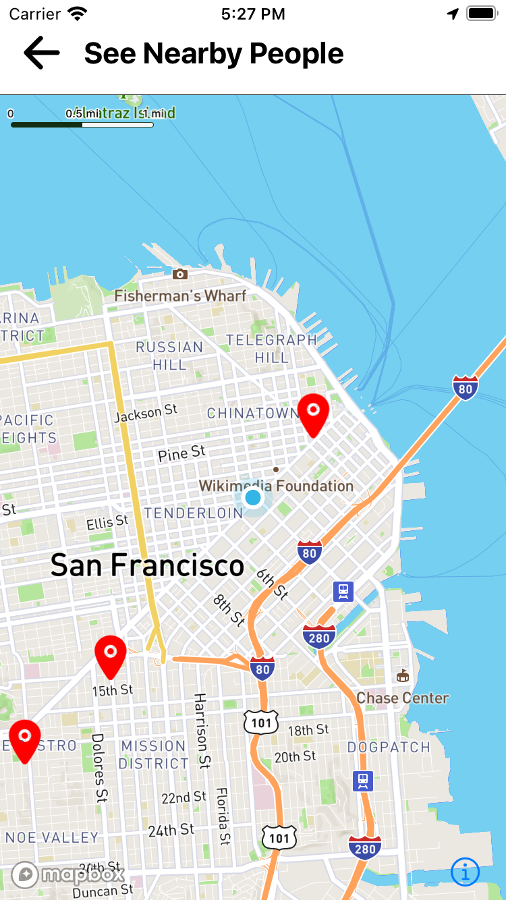
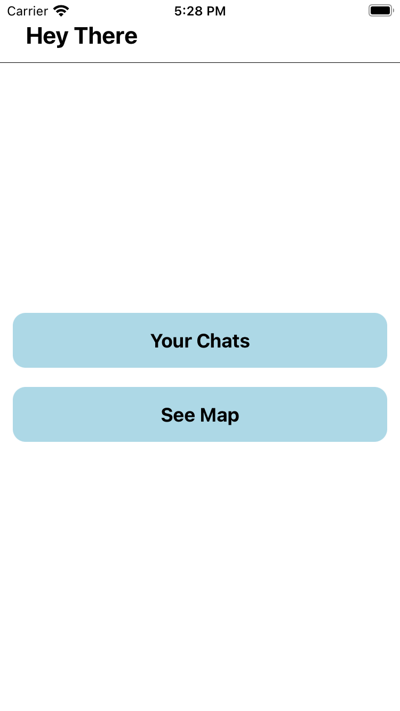
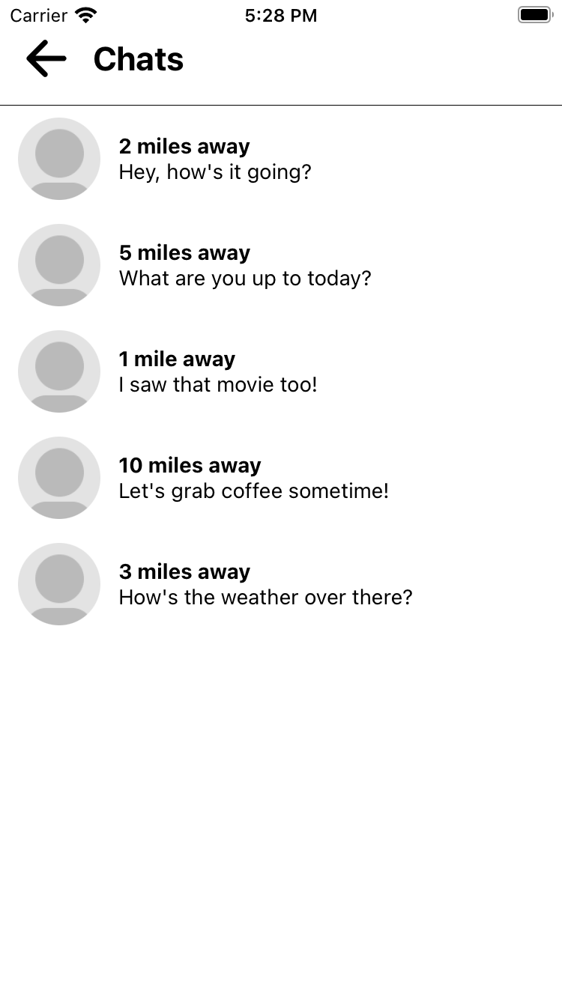
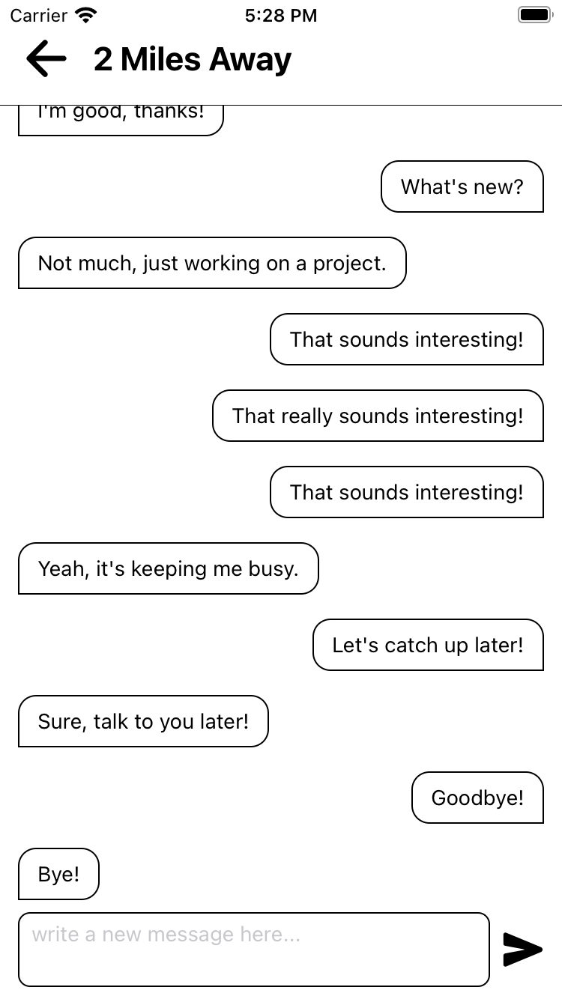

prototype App to search people nearby on map and start chattting

## Step 1: Update your mapbox credentials

Rename .local.env to .env and update your mapbox access token there

Open android/gradle.properties and update your MAPBOX_DOWNLOADS_TOKEN

for IOS if you are getting error on pod install
follow this https://stackoverflow.com/questions/64007478/cocoapods-error-installing-mapbox-ios-sdk

## Step 2: Start the Metro Server

First, you will need to start **Metro**, the JavaScript _bundler_ that ships _with_ React Native.

To start Metro, run the following command from the _root_ of your React Native project:

```bash
# using npm
npm start

# OR using Yarn
yarn start
```

## Step 3: Start your Application

Let Metro Bundler run in its _own_ terminal. Open a _new_ terminal from the _root_ of your React Native project. Run the following command to start your _Android_ or _iOS_ app:

### For Android

```bash
# using npm
npm run android

# OR using Yarn
yarn android
```

### For iOS

```bash
# using npm
npm run ios

# OR using Yarn
yarn ios
```

If everything is set up _correctly_, you should see your new app running in your _Android Emulator_ or _iOS Simulator_ shortly provided you have set up your emulator/simulator correctly.

This is one way to run your app — you can also run it directly from within Android Studio and Xcode respectively.

## Screenshots





